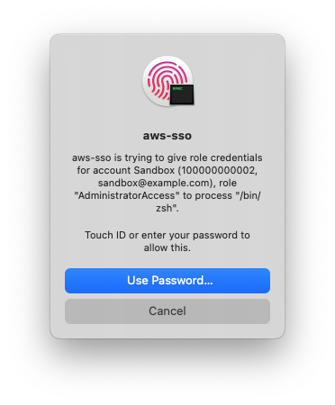

# aws-sso

Proof-of-concept tool to safely store AWS SSO credentials in your keychain.

## Why

I've used [aws-vault](https://github.com/99designs/aws-vault) forever, and I like that it keeps the credentials away from the file system. This tool aims to solve two problems I have with aws-vault:

1. aws-vault hasn't been updated to use the newer PKCE auth method for SSO, and since the project seems to have been abandoned, I expect it probably won't be
2. aws-vault really just moves the problem: anything can execute it to extract credentials, and the only confirmation you can have is setting your keychain timeout quite low and having to type in your password again. I solve this by showing a Touch ID confirmation each time that credentials are requested, which includes details of the calling process and what credentials have been requested.



## Install

> [!CAUTION]
> I'm not a security expert. You probably shouldn't install this tool.

> [!NOTE]
> This tool only works on MacOS.

```bash
go install github.com/gordonmleigh/aws-sso
```

## Configure

Set up your AWS config file (`~/.aws/config`) with an `sso-profile` and whatever
`profile` sections you want:

```ini
# at least one [sso-session] block is required
[sso-session my-sso]
sso_region=eu-central-1
sso_start_url=https://my-sso-start-url.awsapps.com/start

# you can set up zero or more [profile] blocks for use with the AWS CLI and SDKs
[profile prod-admin]
region=eu-central-1
# refer to an account by name or ID:
credential_process=aws-sso -account Production -role AdministratorAccess -output=json
```

## Usage

### Interactive mode

To start a new shell with SSO credentials, simply run `aws-sso`. Without any arguments, you will be prompted to select an account and role.

You can optionally provide the account and/or role name as arguments:

```shell
$ aws-sso -account Production -role AdministratorAccess
```

You can specify the account as the ID (e.g. 100000000001), or the [Account Name](https://docs.aws.amazon.com/accounts/latest/reference/manage-acct-update-acct-name.html).

### Custom command

By default, aws-sso will run the shell given in the users `SHELL` environment variable. To run something different, add it after all of the options.

The `--` is optional.

```shell
$ aws-sso -account Production -- terraform plan
```

### Non-interactive mode

If you pass `-no-input` or `-output=json`, then no prompts will be shown. If the required values have not been provided as command line options, then you will see an error message and a non-zero exit code.

### JSON mode (`credential_process`)

Using the `-output=json` option will output a JSON format compatible with the [Process credential provider](https://docs.aws.amazon.com/sdkref/latest/guide/feature-process-credentials.html) option in the AWS Config file.

Use it like this:

```ini
# ~/.aws/config

[profile prod-admin]
region=eu-central-1
credential_process=aws-sso -output=json -account Production -role AdministratorAccess
```
